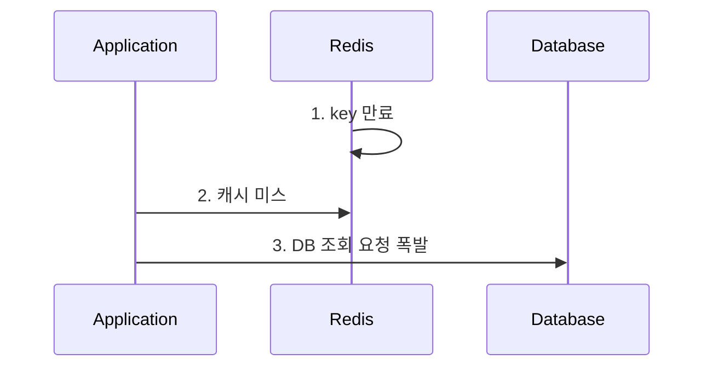

## Cache Stamped 현상

### 1. Cache Stamped 현상이란?

-   Cache Stamped 현상은 캐시 시스템에서 동일한 키에 대한 대량의 요청이 동시에 발생할 때, 캐시 미스가 발생하고 모든 요청이 동시에 데이터베이스에 접근하여 과도한 부하를 발생시키는 현상을 말합니다.



### 2. 해결 방안

1.  주기적인 batch 작업을 통해 캐시 데이터를 갱신하여 해당 키가 만료되지 않도록 하는 방법
1.  캐시 미스가 발생하는 경우 lock (분산락)을 사용하는 방법

    ```typescript
    const resource = `locks:${cacheKey}`; // 락 리소스 이름
    const ttl = 10000; // 락의 TTL (10초)

    try {
        // Redlock을 사용하여 락 획득
        const lock = await redlock.acquire([resource], ttl);

        try {
            // 락 획득 성공 시, 데이터베이스에서 데이터 가져오기
            const data = await fetchDataFromDatabase();
            await redis1.set(cacheKey, JSON.stringify(data), 'EX', 60); // 데이터 캐시
        } finally {
            // 락 해제
            await lock.release();
        }
    } catch (error) {
        // 락 획득 실패 시, 캐시가 채워질 때까지 대기
        await waitForCache(cacheKey);
    }
    ```

1.  PER 알고리즘을 사용하여, 조회 요청시, TTL 만료 시간이 가까워짐에 따라 갱신 확률을 증가시키는 방법

    ```typescript
    const earlyRecomputeProbability = (remainingTTL: number, maxTTL: number) => {
        return Math.max(0, 1 - remainingTTL / maxTTL);
    };

    const cacheKey = 'myCacheKey';

    const maxTTL = 60; // 캐시 항목의 최대 TTL (초)
    const cachedData = await redis.get(cacheKey);

    if (cachedData) {
        const remainingTTL = await redis.ttl(cacheKey);
        const probability = earlyRecomputeProbability(remainingTTL, maxTTL);

        // 확률적으로 조기 재계산 수행
        if (Math.random() < probability) {
            const newData = await fetchDataFromDatabase();
            await redis.set(cacheKey, JSON.stringify(newData), 'EX', maxTTL);
            return newData;
        }

        return JSON.parse(cachedData);
    } else {
        // 캐시 미스 발생 시, 데이터를 가져와 캐시에 저장
        const data = await fetchDataFromDatabase();
        await redis.set(cacheKey, JSON.stringify(data), 'EX', maxTTL);
        return data;
    }
    ```
